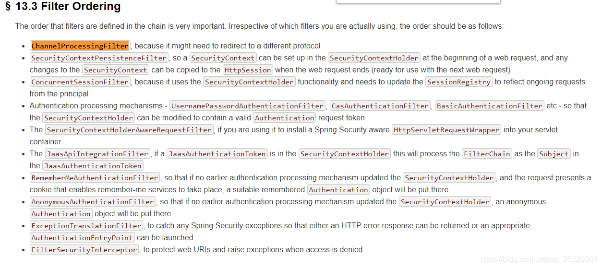
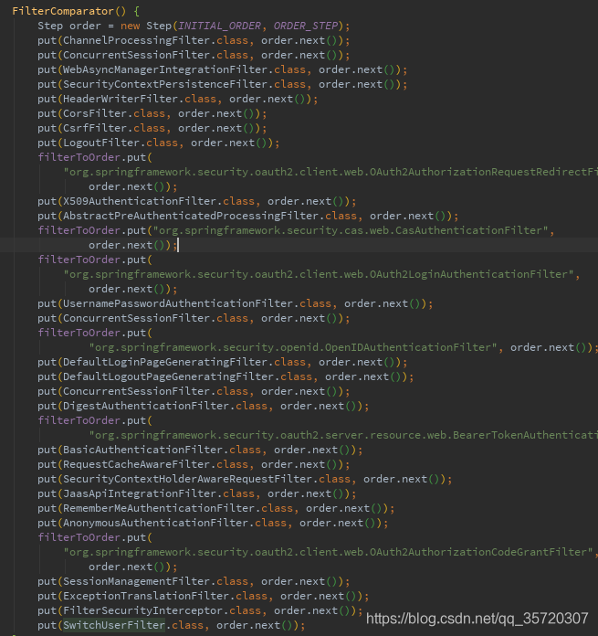
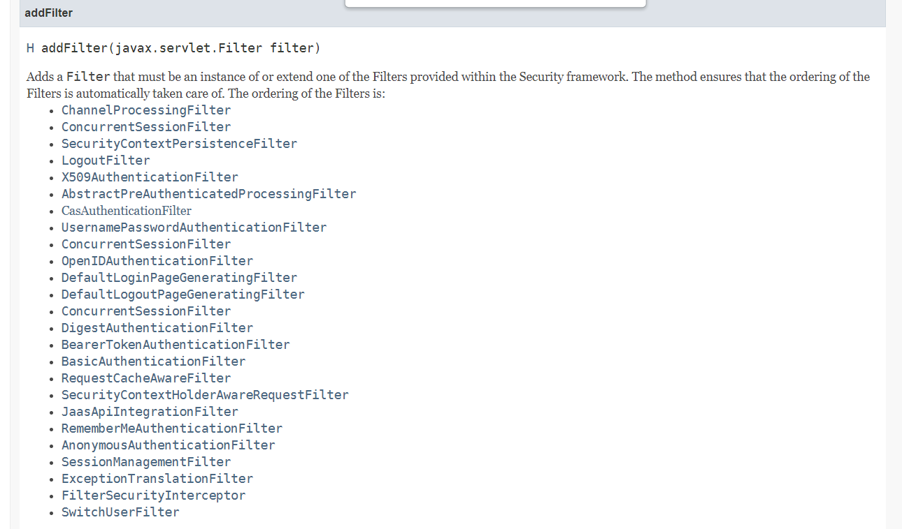

ChannelProcessingFilter

使用https还是http的通过过滤器

WebAsyncManagerIntegrationFilter

此过滤器使得WebAsync异步线程能够获取到当前认证信息

SecurityContextPersistenceFilter

主要控制 SecurityContext 的在一次请求中的生命周期，请求结束时清空，防止内存泄漏

HeaderWriterFilter

请求头过滤器

CorsFilter

跨域过滤器

CsrfFilter

csrf过滤器

LogoutFilter

登出过滤器

OAuth2AuthorizationRequestRedirectFilter

Oauth2请求鉴权重定向过滤器，需配合OAuth2.0的模块使用

Saml2WebSsoAuthenticationRequestFilter

Saml2单点认证过滤器 需配合Spring Security SAML模块使用

X509AuthenticationFilter

X.509证书认证过滤器

AbstractPreAuthenticatedProcessingFilter

处理经过预先认证的身份验证请求的过滤器的基类

CasAuthenticationFilter

CAS 单点登录认证过滤器 。配合Spring Security CAS模块使用

OAuth2LoginAuthenticationFilter

OAuth2 登录认证过滤器

Saml2WebSsoAuthenticationFilter

SMAL 的 SSO 单点登录认证过滤器

UsernamePasswordAuthenticationFilter

用户名密码认证过滤器

OpenIDAuthenticationFilter

OpenID认证过滤器

DefaultLoginPageGeneratingFilter

默认登入页生成过滤器

DefaultLogoutPageGeneratingFilter

默认登出页生成过滤器

ConcurrentSessionFilter

session管理，用于判断session是否过期

DigestAuthenticationFilter

摘要认证过滤器

BearerTokenAuthenticationFilter

Bearer标准token认证过滤器

BasicAuthenticationFilter

Http Basic标准认证过滤器

RequestCacheAwareFilter

请求缓存过滤器，主要作用是认证完成后恢复认证前的请求继续执行

SecurityContextHolderAwareRequestFilter

对request包装的目的主要是实现servlet api的一些接口方法isUserInRole、getRemoteUser

JaasApiIntegrationFilter

Jaas认证过滤器

RememberMeAuthenticationFilter

RememberMe 认证过滤器

AnonymousAuthenticationFilter

匿名认证过滤器

OAuth2AuthorizationCodeGrantFilter

OAuth2授权码过滤器

SessionManagementFilter

Session 管理器过滤器，内部维护了一个SessionAuthenticationStrategy 用于管理 Session

ExceptionTranslationFilter

异常翻译过滤器

FilterSecurityInterceptor

请求鉴权过滤器

SwitchUserFilter

账户切换过滤器

